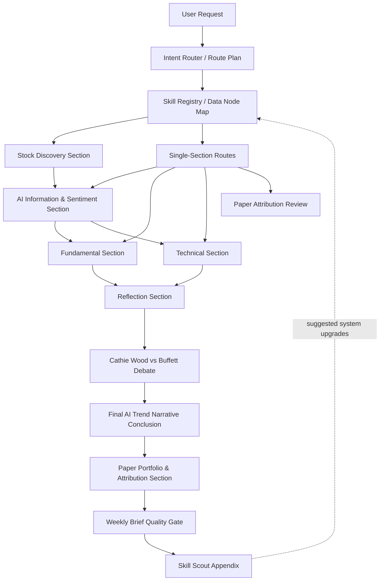

# AI 美股投资研究 Agency

这是一个面向 AI 产业趋势和美股投资研究的多 Agent 工作流。

它不会自动交易，不会下单，不会给仓位建议。它可以在最终结论里给出研究型买卖倾向和置信度，用于 Top 5 观察池和下周归因。这里的“持仓范围”指研究观察/持有时间窗口，不是仓位比例。它的目标是每周把 AI 科技新闻、播客、舆情、GitHub、论文、美股基本面和技术面数据组织成一份可审查的研究报告。

## 核心链路



核心节奏：先由 Intent Router 判断本次该跑全链路还是单点分析，再控噪生成候选池，之后做信息/基本面/技术面验证。Reflection 审闭环，最终结论进入 Conclusion Pool 和 shadow ledger，下周再用价格和 benchmark 做归因。

## 关键理念

- Skills 是数据输入节点，不是最终判断者。
- 任何周报或实验先运行 Intent Route Plan，再运行对应 agent；但发布报告第一屏必须是老板决策页，Route Plan 放附录。
- 舆情只能识别市场关注和候选叙事，不能证明财务改善。
- 基本面必须把叙事落到收入、利润、现金流、capex、margin、估值或预期差。
- 技术面第一轮只看图表，不能被新闻或叙事污染。
- Reflection 只审查上游证据，不新增事实。
- 长期远演可以大胆，但必须标注事实、推断和长期假设。
- Stock Discovery 负责控噪，每周默认最多 8 个 active candidates。
- Paper Portfolio & Attribution 用 shadow ledger 做研究反馈，不连接真实账户、不下单。
- 最终报告可以输出研究型 `Research Buy / Hold-Watch / Take-Profit / Trim Bias / Avoid-Sell Bias / No Rating`，但不输出目标价、仓位比例、下单或自动交易动作。
- 结论池记录用户每天实际选择观察的股票；默认周五分析、下周一假设买入、下周五复盘。
- Top 5 必须包含预估涨幅区间、预计观察/持有周期和卖出/止盈规则。
- Skill Scout 已授权低风险自动安装：仅限满足 benchmark、README/SKILL 可审、且无交易/账户/隐私权限的只读数据或 reasoning skills；安装记录必须写入维护附录。

## Agent 双链接索引

| Agent | Prompt | 说明文档 | 职责 |
|---|---|---|---|
| Intent Router / Harness Router | [Prompt](agents/08-intent-router.md) | [Docs](docs/agent-responsibilities.md#0-intent-router--harness-router) | 根据用户提示词选择任务类型、agent 路径、skills 和质量门槛 |
| Stock Discovery Analyst | [Prompt](agents/00-stock-discovery-analyst.md) | [Docs](docs/agent-responsibilities.md#0-stock-discovery-analyst) | 候选股票发现、控噪、active/watch/reject 分层 |
| AI Information & Sentiment Analyst | [Prompt](agents/02-ai-information-sentiment-analyst.md) | [Docs](docs/agent-responsibilities.md#1-ai-information--sentiment-analyst) | 新闻、播客、舆情、GitHub、arXiv、趋势故事草案 |
| Fundamental Analyst | [Prompt](agents/03-fundamental-analyst.md) | [Docs](docs/agent-responsibilities.md#2-fundamental-analyst) | 美股基本面验证和财务传导链 |
| Technical Analyst | [Prompt](agents/04-technical-analyst.md) | [Docs](docs/agent-responsibilities.md#3-technical-analyst) | K 线、价格行为、支撑阻力、技术情景 |
| Reflection Judge | [Prompt](agents/05-reflection-judge.md) | [Docs](docs/agent-responsibilities.md#4-reflection-judge) | 闭环审查、Wood vs Buffett 辩论 |
| AI Trend Narrative Analyst | [Prompt](agents/01-ai-trend-narrative-analyst.md) | [Docs](docs/agent-responsibilities.md#5-ai-trend-narrative-analyst) | 最终 AI 趋势投资研究结论 |
| Paper Portfolio & Attribution | [Prompt](agents/07-paper-portfolio-attribution-agent.md) | [Docs](docs/agent-responsibilities.md#6-paper-portfolio--attribution-agent) | 模拟观察账本、下周表现回看、归因和信号权重迭代 |
| Skill Scout | [Prompt](agents/06-skill-scout.md) | [Docs](docs/agent-responsibilities.md#7-skill-scout) | 每周 GitHub skills / plugins 升级建议和低风险自动安装 |

## 当前已安装 Skill Scopes

完整 skill 用途、API、降级和禁止用途见：[docs/skill-registry.md](docs/skill-registry.md)。

### Intent Router

- `docs/skill-registry.md`
- installed skill inventory

### 信息与舆情

- `last30days`
- `youtube-full`：TranscriptAPI-backed 主 YouTube skill，覆盖 transcript / search / channel / playlist；配置 `TRANSCRIPT_API_KEY` 即可，不需要重复安装 ClawHub 的 `transcriptapi` skill
- `bibi`
- `ak-rss-digest`
- `transcript-polisher`

### 美股市场与催化剂

- `longbridge`
- `longbridge-market-data`
- `longbridge-intel`
- `nasdaq-data`
- `finviz`
- `tradingview`
- `yahoo-finance`
- `global-stock-data`：零鉴权美股/港股行情、K 线、技术指标、基本面、SEC filing 和全市场列表交叉验证；作为冗余只读数据源使用

### 基本面

- `financial-data-collector`
- `longbridge-fundamentals`
- `longbridge-earnings`
- `longbridge-research`
- `longbridge-value-investing`
- `sec-data`
- `nasdaq-data`
- `earningswhispers`
- `yahoo-finance`
- `finviz`
- `global-stock-data`
- `alpha-vantage`
- `finnhub`

### 技术面与市场状态

- `technical-analyst`
- `longbridge-technical`
- `longbridge-market-data`
- `tradingview`
- `yahoo-finance`
- `global-stock-data`
- `cboe-data`
- `fred-macro`
- `finviz`

### Reflection

- `cathie-wood-perspective`
- `buffett-perspective`

## 配置

复制 `.env.example` 到 `.env` 并填入本地密钥。

```bash
cp .env.example .env
```

不要提交 `.env`。仓库已经通过 `.gitignore` 忽略真实密钥文件。

当前推荐 LLM 网关是 Viviai / New API，按 OpenAI-compatible 方式使用：

- `OPENAI_API_KEY`
- `OPENAI_BASE_URL=https://api.viviai.cc/v1`
- `OPENAI_MODEL=gpt-5.5`
- `LLM_MODEL=gpt-5.5`
- `LLM_FAST_MODEL=gpt-5.4-mini`

`gpt-5.5` 用于最终周报和复杂推理，`gpt-5.4-mini` 用于快速摘要、清洗和低成本子任务。

常用外部数据变量：

- `ALPHA_VANTAGE_API_KEY`
- `FINNHUB_API_KEY`
- `FRED_API_KEY`
- `SEC_EDGAR_USER_AGENT`
- `OPENAI_API_KEY`
- `OPENROUTER_API_KEY`
- `PERPLEXITY_API_KEY`
- `TRANSCRIPT_API_KEY`
- `SCRAPECREATORS_API_KEY`
- `BIBI_API_TOKEN`

YouTube 说明：

- 本项目已经安装 `youtube-full`，它使用 TranscriptAPI.com，能力覆盖你在 TranscriptAPI onboarding 页面看到的 Agent Skills。
- 如果页面提示 `Install transcriptapi skill from clawhub and configure it`，在本项目中等价处理是配置 `TRANSCRIPT_API_KEY` 给 `youtube-full`。
- 不要同时安装重复的 `transcriptapi` skill，除非未来决定用它替换 `youtube-full`。

完整配置清单见：

- [docs/api-configuration.md](docs/api-configuration.md)
- [docs/agent-responsibilities.md](docs/agent-responsibilities.md)
- [docs/skill-registry.md](docs/skill-registry.md)

Longbridge 通常通过 CLI/MCP 授权，而不是写入 `.env`。本项目只使用 read-only research mode，不请求交易权限。

Paper feedback 默认使用 `PAPER_TRADING_MODE=shadow_ledger`，不连接 broker。未来如果要开启 `paper_api`，必须单独配置 sandbox/paper keys，并保持 live trading 禁用。

安装或更新 skills 后，请重启 Codex 或开启新线程，让新 skills 被会话重新加载。

## 每周运行方式

新聊天中让 Codex 读取：

- [AGENCY.md](AGENCY.md)
- [docs/ai-investment-agent-system.md](docs/ai-investment-agent-system.md)
- [docs/weekly-brief-quality-gate.md](docs/weekly-brief-quality-gate.md)
- [docs/skill-registry.md](docs/skill-registry.md)

然后按 Harness Agent 流程依次运行：

1. Intent Router，输出 Intent Route Plan。
2. 如果 Route Plan 是完整周报，运行 Stock Discovery Section。
3. AI Information & Sentiment Section。
4. Fundamental Section。
5. Technical Section。
6. Reflection Section。
7. Final AI Trend Narrative Conclusion。
8. Paper Portfolio & Attribution Section。
9. Weekly Brief Quality Gate。
10. Skill Scout Appendix。

最终发布报告必须先输出给内部投资研究老板看的老板决策页：主结论、Top 5 Research Action Pool、研究动作、最硬证据、最大证伪风险和下周验证。Intent Route Plan、运行边界、数据节点状态、工具失败和质量检查必须后置到附录。

主报告必须使用双跳证据链接：每个 Top 5 / 核心候选在主报告里只保留证据摘要和 `Evidence Pack` 链接；完整证据链写入同名子文件 `reports/{report_slug}.evidence.md`，再由子文件链接到官方披露、SEC、IR、新闻、论文、GitHub、transcript 或社区讨论原始来源。

最终结论必须给每个核心候选一个研究型 action rating 和 0-100 置信度。默认只有置信度 `>=75` 且信息/基本面/技术面/Reflection 没有重大断裂的标的，才能进入 Top 5 Research Action Pool。每个 Top 5 候选必须包含预估涨幅区间、预计观察/持有周期和卖出/止盈规则。这个池只进入 Conclusion Pool、shadow ledger 和下周归因，不代表真实下单。

默认闭环：

```text
Friday final report
  -> Conclusion Pool records user-selected candidates
  -> next Monday close hypothetical entry
  -> next Friday close review
  -> expected upside vs actual return attribution
  -> sell / trim / hold review
```

## 质量门槛

最终周报必须包含：

- 老板决策页，且位于发布报告最前面。
- 核心判断与 2-3 条硬证据。
- 每个 Top 5 / 核心候选的 `Evidence Pack` 链接。
- 同名证据子文件 `reports/{report_slug}.evidence.md`。
- 按证据强度分层的研究排序。
- Top 5 Research Action Pool：研究型买卖倾向、置信度、进入理由、失效条件。
- 结论池：记录用户选择、下周一假设买入、下周五复盘、预估涨幅区间、持有周期和卖出/止盈规则。
- 10 条 AI 技术新闻。
- 5 篇 AI 学术论文。
- 5 个 AI 开源项目。
- 5 条高信号舆情证据。
- 当前观察到的 AI 趋势故事。
- 长期远演版 AI 趋势展望。
- AI 产业链外推图。
- 基本面传导链。
- 技术面关键价位和情景。
- Reflection 闭环审查。
- Wood vs Buffett 辩论摘要。
- Stock Discovery 候选池和噪音过滤。
- Paper Portfolio & Attribution 观察账本和归因。

任何数据节点失败都必须标记为 `partial` 或 `failed`，不得编造补齐。

## 已交付文档

- [AGENCY.md](AGENCY.md)：主 harness 运行手册。
- [AGENTS.md](AGENTS.md)：项目级规则。
- [docs/ai-investment-agent-system.md](docs/ai-investment-agent-system.md)：系统设计。
- [docs/weekly-brief-quality-gate.md](docs/weekly-brief-quality-gate.md)：质量门槛。
- [docs/agent-responsibilities.md](docs/agent-responsibilities.md)：每个 agent 的职责、输入、输出和边界。
- [docs/skill-registry.md](docs/skill-registry.md)：每个 skill/data node 的用途、归属 agent、API、降级和禁止用途。
- [docs/skill-scout-install-log.md](docs/skill-scout-install-log.md)：Skill Scout 自动安装和拒绝候选的证据日志。
- [docs/api-configuration.md](docs/api-configuration.md)：API 和模型配置说明。
- [docs/noise-control-and-paper-portfolio-loop.md](docs/noise-control-and-paper-portfolio-loop.md)：噪音控制和模拟观察闭环。
- [data/conclusion-pool/README.md](data/conclusion-pool/README.md)：结论池和周五/周一/周五复盘协议。
- [docs/weekly-reminder.md](docs/weekly-reminder.md)：本机周五提醒和复盘节奏。
- [docs/next-experiment-and-ui-roadmap.md](docs/next-experiment-and-ui-roadmap.md)：下一步实验计划、Stock Discovery scales/API、UI 路线图。
- [docs/agency-implementation-report.md](docs/agency-implementation-report.md)：实施报告与资深研究视角把关。

## 状态

当前版本：`v0.4-research-action-pool`

当前重点：先用 Intent Router 生成 Route Plan，再跑一次最小实验，验证 Stock Discovery 候选池、Top 5 Research Action Pool、Conclusion Pool 和 Paper Portfolio & Attribution 反馈闭环是否可用。
