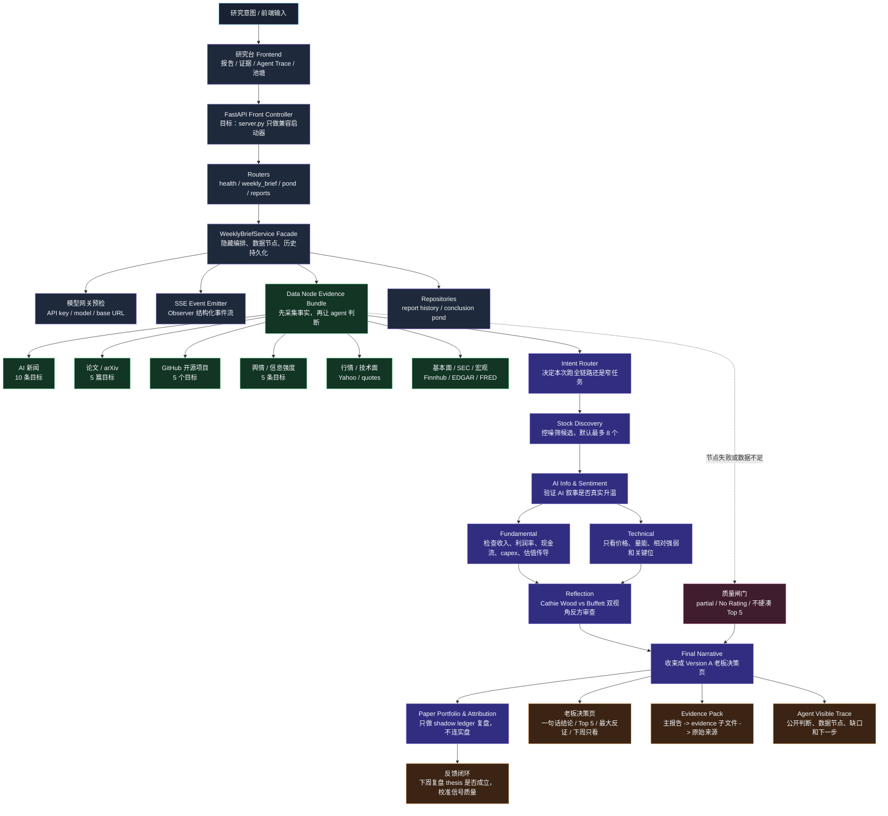
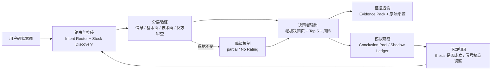
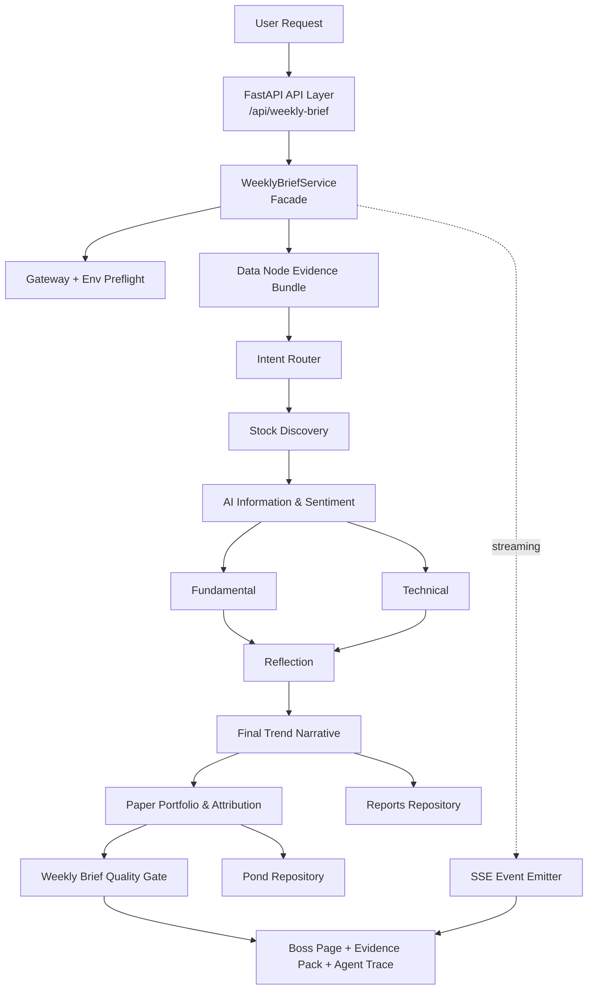

# AI 美股投资研究 Agency

> **一句话介绍**
>
> 这个项目不是一个“AI 自动选股工具”，而是一套由 9 个 agent 组成的 AI 美股投研工作流，专门研究 AI 产业趋势如何传导到美股公司。它会把新闻、论文、GitHub 开源项目、YouTube/播客、社区舆情、财报、SEC 文件和技术面数据，分别交给 Intent Router、Stock Discovery、AI Information & Sentiment、Fundamental、Technical、Reflection、Final Trend Narrative、Paper Portfolio & Attribution、Skill Scout 这 9 个 agent 处理，最后汇总成一份中文投资研究周报。它和普通投研笔记不一样的地方在于，不是追热点喊买卖，而是强制每个结论都有证据链、反证条件和下周复盘；主报告先给一页老板能看懂的 Top 5 决策页，长证据放到独立 evidence 文件里。比较巧的是，它把“AI 叙事”拆成一条可审查的流水线：先控噪筛候选，再验证信息、基本面和技术面，最后用 Cathie Wood vs Buffett 两种视角做反方审查，并用模拟观察账本记录下周结果，反过来校准自己的信号质量。它更像一个会复盘、会自我质疑的 AI 投研团队，而不是一个喊买卖的黑盒。

## 产品架构图：把 AI 投研从“生成答案”变成“可审计流水线”



面试时可以这样讲这个项目的巧思：

- **我没有让 LLM 直接写投资结论，而是把投研拆成可控图工作流**：数据节点先采集事实，agent 再按角色分工判断，最后由 Harness 统一组装报告。
- **每个结论都有降级机制**：如果新闻、论文、GitHub、行情、基本面或舆情节点不足，系统会明确标 `partial / No Rating`，不会为了好看硬凑 Top 5。
- **报告结构服务决策者，而不是服务模型炫技**：第一页永远是老板决策页，长证据放 evidence pack，既能快速读结论，也能追溯每条证据。
- **它有复盘闭环**：研究动作进入 shadow ledger，下周用价格和 thesis 归因回看信号质量，让系统不是一次性生成器，而是会自我校准的投研流程。
- **工程上有稳定交付设计**：下一步后端按 FastAPI 模块化单体重构，`server.py` 保持兼容启动入口，路由、服务、数据适配器、仓储和 SSE 事件流分层拆开，避免巨型文件拖慢调试。

## AI 产品经理面试速讲版

如果面试官只有 30 秒，可以这样讲：

> 我做的是一个 AI 美股投研研究台，不是自动荐股工具。它把新闻、论文、开源项目、社区舆情、财报和行情这些分散信息，拆给不同 agent 做验证，最后输出一页老板决策页、证据包和下周复盘账本。这个项目重点体现的是 AI PM 如何把模型能力产品化成一个可追溯、可降级、可复盘的工作流。

### 我在这个项目里做的产品决策

| 产品问题 | 我的设计 | 面试时要讲出的能力 |
|---|---|---|
| 信息太杂，LLM 容易把热点写成结论 | 先跑 Intent Router 和 Stock Discovery，候选默认最多 8 个 | 需求拆解、控噪、任务路由 |
| 金融判断风险高，不能直接给交易建议 | 只输出 research action，不接交易账户、不做仓位和下单 | 高风险 AI 产品边界意识 |
| 研报长但不可追溯 | 老板决策页 + evidence pack + 双跳证据链接 | 面向决策者的输出设计 |
| 多 agent 容易互相重复或放大幻觉 | 每个 agent 有固定角色、输入、过滤规则、输出 schema 和禁止行为 | Agentic workflow 设计 |
| 一次性生成无法证明长期有效 | Conclusion Pool + Paper Portfolio 做 shadow ledger 复盘 | 指标闭环和产品迭代意识 |
| 后端逻辑堆在单文件里，后续难维护 | FastAPI 模块化单体：router / service / client / repository / schema / core 分层 | 从原型走向可维护产品架构 |

### 产品闭环流程图



### 项目亮点

- **从“会生成”升级到“可运营”**：不仅让模型写报告，还定义了输入、路由、质量门槛、失败降级、证据追溯和复盘。
- **把复杂任务拆成产品流程**：先控噪，再验证，再反思，最后收束，避免模型直接从舆情跳到投资结论。
- **输出服务真实用户场景**：老板页适合快速决策，证据包适合审计，agent trace 适合建立信任。
- **边界清晰**：项目只做研究，不做个性化投资建议、仓位、下单、账户读取或自动交易。
- **能迁移到其他 AI 产品**：同样的方法可以用于经营分析、风控诊断、市场研究、竞品监控和知识工作流。

### AI 产品经理面试 Q&A

**Q1：这个项目和普通 AI 研报生成有什么区别？**

普通研报生成更像“一次性写作”，这个项目是“可审计工作流”。我把结论拆成事实、推断、假设、反证条件和下周验证点，并用 evidence pack 追到原始来源。

**Q2：为什么要做多 agent？**

不是为了堆角色，而是为了职责隔离。信息 agent 只判断叙事是否升温，Fundamental 检查财务传导，Technical 看价格行为，Reflection 专门找断裂点，Final 才能收束成结论。

**Q3：如何控制幻觉？**

核心是四层约束：数据节点先给事实；agent prompt 限定输入和禁止行为；最终报告必须区分事实、推断、假设；数据不足时降级为 `partial / No Rating`，不允许补编内容。

**Q4：为什么不直接做自动交易？**

这是刻意的产品边界。早期最该验证的是研究 thesis 质量，而不是交易执行能力。所以系统只做 research action 和 shadow ledger，不接真实账户。

**Q5：怎么衡量这个项目效果？**

我会看三类指标：报告是否可读、证据是否可追溯、复盘是否能解释信号质量。比如 Top 5 是否有 evidence pack、数据失败是否正确降级、下周 attribution 是否能区分 thesis 错、时机错还是市场已提前定价。

**Q6：这个项目最能体现你的 AI PM 能力在哪里？**

它体现的是我能把一个开放、风险高、容易幻觉的 AI 任务，拆成有用户场景、有安全边界、有 workflow、有质量门槛、有前端呈现、有复盘闭环的产品系统。

## 这个项目解决什么问题

AI 投资信息源很分散：新闻、发布会、YouTube、播客、GitHub、arXiv、财报、SEC 文件、K 线和社区讨论经常同时影响市场叙事。

这个仓库把这些输入拆给不同 agent 处理，并用一个 Harness Agent 串起来：

- 先判断本次任务该跑完整周报，还是只跑选股、基本面、技术面、归因或维护任务。
- 先控噪筛候选，再做信息、基本面、技术面和反思审查。
- 把证据和推断分开，把短期观察和长期假设分开。
- 把核心结论放在报告第一页，把长证据表放到独立 evidence 文件。
- 用 shadow ledger 记录研究结果，方便下周复盘信号是否有效。

## 最终产出

一次完整周报会生成：

- **老板决策页**：第一屏直接给结论、Top 5、研究动作、最大反证和下周验证点。
- **Top 5 Research Action Pool**：最多 5 个研究候选，包含 rating、置信度、预估涨幅区间、观察周期和退出/止盈规则。
- **Evidence Pack**：主报告只放证据摘要；完整证据链写到同名 `*.evidence.md` 子文件。
- **AI 信息模块**：10 条 AI 技术新闻、5 篇论文、5 个开源项目、5 条高信号舆情证据。
- **基本面与技术面验证**：检查叙事是否能落到收入、利润、现金流、capex、margin、估值或预期差。
- **Reflection 审查**：用闭环审查和 Cathie Wood vs Buffett 视角辩论暴露最弱环节。
- **Paper Portfolio & Attribution**：只做模拟观察和信号归因，不连接真实交易账户。

## 核心流程



运行顺序是固定的 directed pipeline，不是 agent 圆桌讨论。任何周报、实验或单 section 研究都必须先跑 `agents/08-intent-router.md`，但发布报告必须从老板决策页开始，Route Plan 放到附录。

## 后端重构目标：FastAPI 模块化单体

当前后端重构目标是先把 `backend/server.py` 从巨型单文件拆成可维护的 FastAPI 模块化单体，同时保持现有启动命令和 HTTP API 行为兼容。

```text
backend/
├── server.py                  # 兼容启动器：解析参数、加载 .env、启动 uvicorn
└── app/
    ├── main.py                # FastAPI app / Front Controller
    ├── routers/               # health, weekly_brief, pond, reports
    ├── services/              # WeeklyBriefService、workflow、报告组装、模型网关预检
    ├── clients/               # OpenAI-compatible、Finnhub、Yahoo、GitHub、arXiv、SEC、FRED
    ├── repositories/          # 报告历史、池塘 CSV 读写
    ├── schemas/               # Pydantic request / response DTO
    └── core/                  # config、env、errors、time / markdown utils
```

设计模式映射：

| 模式 | 项目里的落点 | 产品价值 |
|---|---|---|
| Front Controller | FastAPI app + routers | 统一 HTTP 入口，替代巨型 Handler |
| Facade | `WeeklyBriefService` | 对路由隐藏数据节点、agent workflow、history persistence 的复杂性 |
| Strategy / Adapter | 每个外部数据 client 实现统一采集接口 | 方便替换 Finnhub、Yahoo、GitHub、arXiv、SEC 等数据源 |
| DAO / Repository | 报告历史和池塘文件读写 | 业务逻辑和文件存储解耦，便于单测 |
| Observer | SSE event emitter | 流式输出结构化事件，不污染最终 payload |

详细方案见 [docs/backend-fastapi-refactor-plan.md](docs/backend-fastapi-refactor-plan.md)。

## 快速开始

### 1. 配置环境变量

复制示例配置：

```bash
cp .env.example .env
```

然后在 `.env` 中填入你本地可用的 key。常用变量包括：

| 类型 | 变量 |
|---|---|
| LLM 网关 | `OPENAI_API_KEY`, `OPENAI_BASE_URL`, `OPENAI_MODEL` |
| 视频/转录 | `TRANSCRIPT_API_KEY`, `BIBI_API_TOKEN` |
| 市场与基本面 | `ALPHA_VANTAGE_API_KEY`, `FINNHUB_API_KEY`, `FRED_API_KEY`, `SEC_EDGAR_USER_AGENT` |
| 研究搜索 | `PERPLEXITY_API_KEY`, `OPENROUTER_API_KEY`, `SCRAPECREATORS_API_KEY` |

最小 `.env` 示例：

```bash
# LLM gateway
OPENAI_API_KEY=your_openai_compatible_key
OPENAI_BASE_URL=https://api.viviai.cc/v1
OPENAI_MODEL=gpt-5.5

# YouTube / podcast transcript
TRANSCRIPT_API_KEY=your_transcriptapi_key_starts_with_sk

# Market and fundamentals data
FINNHUB_API_KEY=your_finnhub_key
FRED_API_KEY=your_fred_key
ALPHA_VANTAGE_API_KEY=your_alpha_vantage_key
SEC_EDGAR_USER_AGENT="Your Name your.email@example.com"

# Optional sentiment / search helpers
SCRAPECREATORS_API_KEY=your_scrapecreators_key
PERPLEXITY_API_KEY=your_perplexity_key
OPENROUTER_API_KEY=your_openrouter_key

# Research feedback mode
PAPER_TRADING_MODE=shadow_ledger
```

完整说明见 [docs/api-configuration.md](docs/api-configuration.md)。

### 2. 在 Codex 新线程中运行周报

让 Codex 读取这些文件：

- [AGENCY.md](AGENCY.md)
- [docs/ai-investment-agent-system.md](docs/ai-investment-agent-system.md)
- [docs/weekly-brief-quality-gate.md](docs/weekly-brief-quality-gate.md)
- [docs/research-report-output-standard.md](docs/research-report-output-standard.md)
- [docs/skill-registry.md](docs/skill-registry.md)

然后发起类似任务：

```text
按 AGENCY.md 跑本周 AI 美股投资研究周报。
必须先运行 Intent Router，最终报告从老板决策页开始，证据使用双跳链接。
```

如果只想跑某个模块，也先让 Intent Router 判断路线，例如：

```text
只跑本周 AI infra 股票发现，不生成完整周报。
```

## 关键规则

- Skills 和 plugins 只作为数据输入节点，不是最终推理权威。
- 投资输出保持 research-oriented；可以给研究动作 rating，但不能给下单、仓位、自动交易或券商操作指令。
- 美股金融数据栈只读使用，不请求交易权限，不读取私人账户数据。
- 每个投资判断都要区分事实、推断和假设。
- 长期远演必须和当前观察分开写。
- 数据节点失败或返回不足时必须显式标记 `partial` 或 `failed`，不能编造补齐。
- Published report 使用双跳证据链接：主报告 -> evidence 子文件 -> 原始来源。
- 默认中文输出，除非任务明确要求英文。

## Agent 目录

| Agent | Prompt | 职责 |
|---|---|---|
| Intent Router | [agents/08-intent-router.md](agents/08-intent-router.md) | 判断任务类型、执行路径、skills/data nodes、缺失配置和质量门槛 |
| Stock Discovery | [agents/00-stock-discovery-analyst.md](agents/00-stock-discovery-analyst.md) | 发现候选股票，默认最多 8 个 active candidates |
| AI Information & Sentiment | [agents/02-ai-information-sentiment-analyst.md](agents/02-ai-information-sentiment-analyst.md) | 新闻、论文、GitHub、YouTube、播客和舆情证据 |
| Fundamental | [agents/03-fundamental-analyst.md](agents/03-fundamental-analyst.md) | 财报、SEC、估值、预期差和财务传导链 |
| Technical | [agents/04-technical-analyst.md](agents/04-technical-analyst.md) | 图表优先的价格行为、支撑阻力和技术情景 |
| Reflection | [agents/05-reflection-judge.md](agents/05-reflection-judge.md) | 闭环审查，含 Cathie Wood vs Buffett 视角辩论 |
| Final Trend Narrative | [agents/01-ai-trend-narrative-analyst.md](agents/01-ai-trend-narrative-analyst.md) | 生成最终 AI 趋势投资研究结论 |
| Paper Portfolio & Attribution | [agents/07-paper-portfolio-attribution-agent.md](agents/07-paper-portfolio-attribution-agent.md) | shadow ledger、下周复盘和信号归因 |
| Skill Scout | [agents/06-skill-scout.md](agents/06-skill-scout.md) | 维护型 agent，推荐低风险只读 skills/plugins |

更完整的职责说明见 [docs/agent-responsibilities.md](docs/agent-responsibilities.md)。

## 仓库结构

```text
.
├── AGENCY.md                         # Harness Agent 主运行手册
├── AGENTS.md                         # 项目级规则
├── agents/                           # 每个 agent 的系统 prompt 和用户 prompt 模板
├── backend/                          # 本地 weekly brief API；目标重构为 FastAPI 模块化单体
├── frontend/                         # 零依赖静态研究台
├── docs/                             # 系统设计、质量门槛、skill registry、配置文档
├── data/
│   ├── conclusion-pool/              # 用户选择观察的结论池模板
│   └── paper-portfolio/              # shadow ledger / 模拟观察模板
└── reports/                          # 已生成的研究报告和 evidence 子文件
```

## 质量门槛

完整周报必须通过 [docs/weekly-brief-quality-gate.md](docs/weekly-brief-quality-gate.md)。最低要求包括：

| 模块 | 要求 |
|---|---|
| Intent Route Plan | 任务类型、选中/跳过 agents、skill plan、缺失输入、安全边界 |
| Stock Discovery | active candidates 默认不超过 8 个 |
| AI 新闻 | 10 条，含标题、来源、日期和链接 |
| AI 论文 | 5 篇，含标题、作者/机构、日期和链接 |
| AI 开源项目 | 5 个，含 repo、链接和 stars/benchmark 证据 |
| 高信号舆情 | 5 条，含平台、主题、日期/范围和链接 |
| Top 5 Pool | 最多 5 个，每个含 rating、置信度、证据、失效条件、预估涨幅区间、观察周期和退出规则 |
| Evidence Pack | 每个核心候选从主报告链接到同名 evidence 子文件，再链接到原始来源 |
| Downstream Handoff | 每个执行 agent 说明下游应继承什么、缺什么、何时降级、哪些内容不能带入下一环 |

如果数据源不足，报告必须说明哪个输入节点失败或不足，不能用想象内容补齐数量。

## 安全边界

允许：

- 研究型 `Research Buy / Hold-Watch / Take-Profit / Trim Bias / Avoid-Sell Bias / No Rating`
- 置信度、反证条件、下周验证点
- 模拟观察池、shadow ledger、benchmark 归因

禁止：

- 真实下单、自动交易、再平衡、券商账户操作
- 个性化仓位比例、资金分配或账户建议
- 把舆情热度当作财务改善证明
- 把 perspective skills 当作事实来源
- 在数据节点失败时编造新闻、论文、项目、财务数据或链接

## 重要文档

- [AGENCY.md](AGENCY.md)：主 Harness Agent 运行手册。
- [AGENTS.md](AGENTS.md)：项目级规则。
- [agents/README.md](agents/README.md)：agent prompt 索引。
- [docs/ai-investment-agent-system.md](docs/ai-investment-agent-system.md)：系统设计。
- [docs/research-report-output-standard.md](docs/research-report-output-standard.md)：最终报告三种结构、公开格式约束和 agent handoff 契约。
- [docs/agent-responsibilities.md](docs/agent-responsibilities.md)：agent 职责、输入、输出和边界。
- [docs/backend-fastapi-refactor-plan.md](docs/backend-fastapi-refactor-plan.md)：后端 FastAPI 模块化单体重构计划。
- [docs/skill-registry.md](docs/skill-registry.md)：skill/data node 用途、降级和禁止用途。
- [docs/weekly-brief-quality-gate.md](docs/weekly-brief-quality-gate.md)：最终周报验收标准。
- [docs/api-configuration.md](docs/api-configuration.md)：API 和模型配置。
- [docs/noise-control-and-paper-portfolio-loop.md](docs/noise-control-and-paper-portfolio-loop.md)：控噪和模拟观察闭环。
- [data/conclusion-pool/README.md](data/conclusion-pool/README.md)：结论池协议。
- [data/paper-portfolio/README.md](data/paper-portfolio/README.md)：paper portfolio / shadow ledger 协议。

## 当前状态

当前版本：`v0.4-research-action-pool`

已具备：

- 完整多 Agent prompt 结构。
- 周报质量门槛。
- 双跳证据链接规范。
- Top 5 Research Action Pool 规则。
- Conclusion Pool 和 Paper Portfolio 复盘闭环。
- Skill Scout 维护机制。

下一步 `v0.5-backend-modular-monolith`：

- 按 [docs/backend-fastapi-refactor-plan.md](docs/backend-fastapi-refactor-plan.md) 将后端重构为 FastAPI 模块化单体。
- 保持 `python3 backend/server.py --host ... --port ...`、`/api/weekly-brief`、`/api/pond`、`/api/reports` 与前端兼容。
- 把 `routers`、`services`、`clients`、`repositories`、`schemas`、`core` 分层拆清楚，再继续做 workflow debug 和数据节点增强。

下一步路线见 [docs/next-experiment-and-ui-roadmap.md](docs/next-experiment-and-ui-roadmap.md)。
