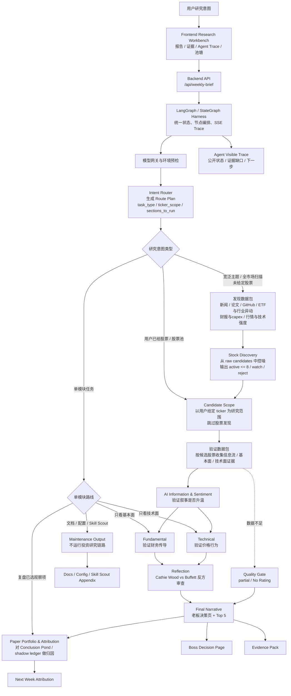

# AI 美股投资研究 Agency

一个面向 AI 产业趋势的美股投研研究台。它不是自动荐股或交易系统，而是把新闻、论文、开源项目、播客/视频、社区舆情、财报、SEC 文件和技术面数据，组织成一条可追溯、可降级、可复盘的多 Agent 研究流程。

## 一句话

把“LLM 直接写研报”升级为“有路由、有证据、有反方审查、有质量门槛、有复盘账本的 AI 投研工作流”。

## 产品亮点

- **决策者优先**：最终报告从「老板决策页」开始，先给结论、Top 5、最大反证和下周验证点。
- **证据可追溯**：主报告只放摘要，详细证据进入同名 evidence 文件，形成「主报告 -> 证据包 -> 原始来源」双跳链接。
- **多 Agent 分工清晰**：Intent Router、Stock Discovery、AI 信息舆情、Fundamental、Technical、Reflection、Final Narrative、Paper Attribution 各自有输入、输出和禁止行为。
- **智能路由编排**：LangGraph / StateGraph Harness 先生成 Route Plan；用户已给股票时跳过发现环节，宽泛主题才进入 Stock Discovery。
- **可降级而不硬凑**：数据节点失败或证据不足时，明确标记 `partial` / `No Rating`，不编造新闻、财务数字或链接。
- **有复盘闭环**：Research Action Pool 可进入 Conclusion Pond / Paper Portfolio，下周做 thesis attribution，校准信号质量。
- **面向产品化演进**：前端展示报告、证据包、Agent Trace 和关注池塘；后端下一步重构为 FastAPI 模块化单体。

## 项目定位

这个项目聚焦研究流程本身：把高风险金融判断拆成数据采集、候选控噪、分层验证、反方审查、证据追溯和模拟复盘。系统关注的是研究质量、证据完整性和后续归因，而不是交易执行。

## 核心流程



### 流程图说明

这张图的重点不是每次都跑同一条流水线，而是先由 `Intent Router` 判断用户到底要什么，再由 LangGraph / StateGraph Harness 按 Route Plan 编排节点。

| 节点 | 含义 |
|---|---|
| `Intent Router` | 先读用户输入，判断任务类型、股票范围、要运行哪些 section、哪些 section 可以跳过，以及质量门槛。 |
| 宽泛主题 / 全市场扫描 | 用户只给主题或问题，例如 AI inference、数据中心、电力、半导体供应链，没有明确 ticker。系统需要先做 Stock Discovery。 |
| 发现数据包 | Stock Discovery 用来找候选的广域输入，包括新闻、论文、GitHub 项目、ETF/行业异动、财报与 capex 线索、行情和技术强度。 |
| `Stock Discovery` | 不是直接做最终结论，而是从 raw candidates 里控噪，输出 active candidates、watchlist 和 reject；active 默认最多 8 个。 |
| 用户已给股票 / 股票池 | 用户已经指定 NVDA、AMD、AVGO 这类 ticker 时，系统不再重新发现股票，而是把这些 ticker 作为 `Candidate Scope` 直接进入验证。 |
| `Candidate Scope` | 当前研究范围。它可能来自用户给定股票，也可能来自 Stock Discovery 输出的 active candidates。 |
| 验证数据包 | 围绕 Candidate Scope 收集证据，供信息舆情、基本面、技术面、反思和最终结论使用。 |
| 单模块任务 | 用户只要求某一块输出时，不跑完整周报。例如“只看 NVDA 基本面”只跑 Fundamental；“只看 AMD 技术面”只跑 Technical；“复盘上周观察池”只跑 Paper Attribution；“整理配置/文档/工具建议”走 Maintenance。 |

## 最终产出

一次完整周报会生成：

| 输出 | 作用 |
|---|---|
| 老板决策页 | 一句话结论、Top 5、研究动作、最大反证、下周验证 |
| Research Action Pool | 最多 5 个候选，包含 rating、confidence、证据、失效条件、观察周期 |
| Evidence Pack | 长证据表、数据节点状态、原始来源链接 |
| Agent Visible Trace | 每个 agent 的公开判断、证据缺口、下一步 |
| Conclusion Pond / Paper Portfolio | 模拟观察和下周归因，不连接真实交易 |

## 产品边界

允许：

- 输出研究型 rating：`Research Buy`、`Hold-Watch`、`Take-Profit / Trim Bias`、`Avoid-Sell Bias`、`No Rating`
- 输出置信度、反证条件、证据摘要、下周验证点
- 做 shadow ledger / paper portfolio 的模拟观察和归因

不允许：

- 不下单、不自动交易、不再平衡、不读取券商账户
- 不给个性化仓位、资金分配或账户操作建议
- 不把舆情热度、GitHub stars、播客观点或技术面强势当作财务证明
- 不在数据节点失败时编造新闻、论文、项目、财务数据或链接

## 快速开始

### 1. 配置环境

```bash
cp .env.example .env
```

常用配置见 [docs/api-configuration.md](docs/api-configuration.md)。

### 2. 启动后端

```bash
python3 backend/server.py --port 8787
```

只测前后端联通：

```bash
WEEKLY_BRIEF_MOCK=1 python3 backend/server.py --port 8787
```

### 3. 启动前端

```bash
python3 -m http.server 5173 --directory frontend
```

打开：

```text
http://127.0.0.1:5173
```

## 下一步迭代

当前版本重点是多 Agent 投研流程、证据链和复盘闭环。下一步会先做后端结构升级，再增强研究能力。

| 方向 | 计划 |
|---|---|
| 后端结构 | 按 [FastAPI 模块化单体计划](docs/backend-fastapi-refactor-plan.md) 拆分 `routers`、`services`、`clients`、`repositories`、`schemas`、`core` |
| 数据节点 | 提升新闻、论文、GitHub、SEC、行情、财报节点稳定性，减少 `partial` |
| 评测体系 | 建立历史周报样本和 bad case 集，评估是否乱给 rating、漏反证、过度依赖单一来源 |
| 复盘看板 | 把 Conclusion Pond / Paper Portfolio 做成更清晰的 signal attribution dashboard |
| 前端体验 | 优化报告历史、Agent Trace、证据包和关注池塘的阅读体验 |

## 文档入口

| 文档 | 用途 |
|---|---|
| [AGENCY.md](AGENCY.md) | Harness Agent 运行手册 |
| [AGENTS.md](AGENTS.md) | 项目级规则和安全边界 |
| [agents/README.md](agents/README.md) | Agent prompt 索引 |
| [docs/README.md](docs/README.md) | 文档地图 |
| [docs/langgraph-orchestration.md](docs/langgraph-orchestration.md) | LangGraph / StateGraph 编排层说明 |
| [docs/agent-responsibilities.md](docs/agent-responsibilities.md) | Agent 职责、输入、输出、边界 |
| [docs/research-report-output-standard.md](docs/research-report-output-standard.md) | 最终报告格式和双跳证据规范 |
| [docs/weekly-brief-quality-gate.md](docs/weekly-brief-quality-gate.md) | 周报质量门槛 |
| [docs/backend-fastapi-refactor-plan.md](docs/backend-fastapi-refactor-plan.md) | 后端 FastAPI 重构计划 |
| [frontend/README.md](frontend/README.md) | 前端研究台说明 |
| [backend/README.md](backend/README.md) | 本地后端 API 说明 |

## 仓库结构

```text
.
├── AGENCY.md                  # Harness Agent 主运行手册
├── AGENTS.md                  # 项目级规则
├── agents/                    # Agent system prompts 和 per-run prompt 模板
├── backend/                   # 本地 weekly brief API
├── frontend/                  # 零依赖静态研究台
├── docs/                      # 系统设计、质量门槛、配置、重构计划
├── data/                      # conclusion pond / paper portfolio 模板和历史
├── reports/                   # 已生成研究报告和 evidence 文件
└── tests/                     # 后端、前端集成和体验测试
```

## 当前状态

- 已具备完整多 Agent prompt 结构。
- 已具备老板决策页、双跳证据链接、质量门槛、Research Action Pool。
- 已具备前端研究台、报告历史、Agent Trace、关注池塘。
- 已定义 FastAPI 模块化后端重构计划。
- 仍是 research-only 原型，不连接真实交易账户。
