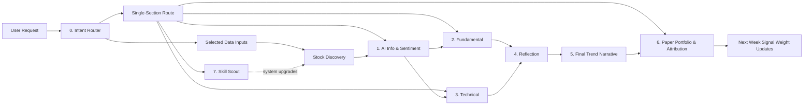

# Agent Responsibilities

返回：[README](../README.md) · [AGENCY](../AGENCY.md) · [Agent Index](../agents/README.md)

这份文档解释每个 agent 负责什么、读取什么、输出什么、不能做什么，以及它在整条链路中的位置。每个 agent 都有两个链接：一个指向可执行 prompt，一个指向本说明段落。

## 总览流程

## 0. Intent Router / Harness Router

Prompt：[agents/08-intent-router.md](../agents/08-intent-router.md)

定位：用户意图识别和执行路径控制层。

它解决的问题：

- 同一个系统既能跑完整周报，也能只跑选股、基本面、技术面、归因、Skill Scout 或 UI/文档规划。
- 在执行前先判断需要哪些 agent，避免所有任务都跑完整链路。
- 把每个 agent 需要的 skills / data nodes、缺失配置和质量门槛写清楚。

输入：

- 用户原始提示词。
- 当前日期、时间范围、主题、ticker、来源链接。
- 当前已安装 skill 列表和 [Skill Registry](skill-registry.md)。
- API 配置状态，如果已知。

输出：

- Intent Route Plan。
- Task type。
- Selected agents / skipped agents。
- Skill / data node plan。
- Missing inputs and defaults。
- Safety boundary check。
- Quality gate requirements。

边界：

- 不做投资判断。
- 不新增事实。
- 不输出买卖建议、目标价、仓位、下单或账户动作。
- 如果是 UI/文档规划，不运行投资研究 agents。

## 0. Stock Discovery Analyst

Prompt：[agents/00-stock-discovery-analyst.md](../agents/00-stock-discovery-analyst.md)

定位：候选股票发现与控噪层。

它解决的问题：

- 数据源越多，候选越多，噪音也越多。
- 在进入深度研究前，先把候选分成 active / watchlist / reject。
- 每周默认最多 8 个 active candidates。

输入：

- 高管/大佬发言：YouTube、播客、发布会、财报会。
- 财报电话会和管理层 commentary。
- 客户 capex、供应链、催化剂、市场异动。
- GitHub/developer adoption。
- 技术面强度、sector rotation、机构/insider/short interest。

输出：

- Active Research Candidates。
- Watchlist Candidates。
- Rejected / Deferred Noise。
- Signal Quality Score。
- Downstream Routing。

边界：

- 候选不是推荐。
- 不输出买卖建议、目标价、仓位。
- 单源信号默认只进 watchlist。

## 1. AI Information & Sentiment Analyst

Prompt：[agents/02-ai-information-sentiment-analyst.md](../agents/02-ai-information-sentiment-analyst.md)

定位：信息摄取、舆情整理、趋势故事草案层。

它解决的问题：

- 把新闻、播客、GitHub、arXiv、社区舆情转成可读的 AI 信息与舆情 section。
- 生成当前观察版趋势故事和长期远演版趋势故事。
- 输出 AI 产业链外推图。

输入：

- Stock Discovery candidate pool。
- RSS/news、YouTube/podcast、last30days、GitHub、arXiv。
- market intel / catalyst headline。

输出：

- 10 条 AI 技术新闻。
- 5 篇 AI 学术论文。
- 5 个 AI 开源项目。
- 5 条高信号舆情证据。
- 当前观察版趋势故事。
- 长期远演版趋势故事。
- AI 产业链外推图。

边界：

- 舆情热度不是事实。
- GitHub 热度不是收入。
- 播客观点不是财务证明。

## 2. Fundamental Analyst

Prompt：[agents/03-fundamental-analyst.md](../agents/03-fundamental-analyst.md)

定位：基本面验证层。

它解决的问题：

- 检验 AI 叙事是否能落到财务科目。
- 区分直接受益、间接受益、估值叙事受益、潜在受损。
- 找出市场已经定价和还没验证的部分。

输入：

- Stock Discovery Section。
- AI Information & Sentiment Section。
- 财报、10-K、10-Q、8-K、earnings call、segment revenue、capex、guidance、valuation multiples、consensus estimates。

输出：

- 公司逐项验证。
- 叙事 -> 财务科目 -> 估值/预期差。
- 数据源交叉验证。
- 可证伪指标。

边界：

- 新闻和舆情不能当基本面改善。
- 没有财务证据只能标为假设。
- 不输出目标价和买卖建议。

## 3. Technical Analyst

Prompt：[agents/04-technical-analyst.md](../agents/04-technical-analyst.md)

定位：价格行为和技术面验证层。

它解决的问题：

- 判断市场价格是否支持候选叙事。
- 通过支撑阻力、量价、均线、情景、失效位约束主观叙事。

输入：

- 候选 tickers。
- OHLCV、K-line、volume、moving averages、support/resistance。

输出：

- 当前趋势。
- 关键价位。
- 量价与均线。
- Bull/base/bear scenario。
- 给 Reflection 的技术结论。

边界：

- 第一轮只看图表，不引用新闻、舆情、基本面。
- 图表支持叙事，不证明叙事。
- 不输出买卖指令或仓位建议。

## 4. Reflection Judge

Prompt：[agents/05-reflection-judge.md](../agents/05-reflection-judge.md)

定位：闭环审查层。

它解决的问题：

- 检查信息、舆情、基本面、技术面是否形成闭环。
- 找出最弱一环。
- 审查长期远演是否跳太远。
- 用 Cathie Wood vs Buffett 视角辩论暴露分歧。

输入：

- AI Information & Sentiment Section。
- Fundamental Report。
- Technical Report。
- Cathie Wood skill。
- Buffett skill。

输出：

- 闭环状态。
- 趋势故事审查。
- 产业链外推审查。
- Perspective Debate。
- 交给最终趋势分析师的处理建议。

边界：

- 不新增事实。
- 不因为多个 agent 乐观就自动乐观。
- perspective skills 是审查镜头，不是证据来源。

## 5. AI Trend Narrative Analyst

Prompt：[agents/01-ai-trend-narrative-analyst.md](../agents/01-ai-trend-narrative-analyst.md)

定位：最终研究结论层。

它解决的问题：

- 将前面所有 section 压缩成最终 AI 趋势投资研究结论。
- 分开输出当前观察到的故事和长期远演版展望。
- 决定保留、降级、暂缓哪些故事。

输入：

- Stock Discovery Section。
- AI Information & Sentiment Section。
- Fundamental Section。
- Technical Section。
- Reflection Section。
- Wood vs Buffett debate summary。

输出：

- 老板决策页。
- Top 5 Research Action Pool。
- 预估涨幅区间。
- 预计观察/持有周期。
- 卖出/止盈规则。
- 核心判断与硬证据表。
- Evidence Pack 链接与同名证据子文件。
- 按证据强度分层的研究排序。
- 本周结论。
- 当前观察到的 AI 趋势故事。
- 长期远演版 AI 趋势展望。
- 结论矩阵。
- 投资影响地图。
- 风险和反证。
- 研究型 action rating：Research Buy / Hold-Watch / Take-Profit / Trim Bias / Avoid-Sell Bias / No Rating。

边界：

- 这是内部投资研究老板看的最终结论稿，不是流程审计或资料仓库。
- 必须结论先行；发布报告不得把 Intent Route Plan、运行边界、数据节点状态、工具失败、质量检查放在主结论之前。
- 第一屏必须给出主结论、第一梯队/第二梯队/观察层/暂不纳入主线、最大证伪风险和下周验证。
- 每个高置信度判断必须配 2-3 条最硬证据摘要和 Evidence Pack 链接，长表格、过程细节和原始来源必须写入同名证据子文件 `reports/{report_slug}.evidence.md`。
- 只有置信度 >=75 且没有重大 Reflection 断裂的 `Research Buy` 可以进入 Top 5 Research Action Pool。
- Top 5 必须包含预估涨幅区间、预计观察/持有周期、卖出/止盈规则和下周五复盘检查。
- 不直接抓原始数据，除非上游缺失关键上下文。
- 长期远演必须标注为场景推演或观察清单。
- 可以输出研究型买卖倾向和置信度；不输出目标价、仓位、下单或账户动作。

## 6. Paper Portfolio & Attribution Agent

Prompt：[agents/07-paper-portfolio-attribution-agent.md](../agents/07-paper-portfolio-attribution-agent.md)

定位：模拟观察和归因反馈层。

它解决的问题：

- 如果系统上周认为某个候选值得观察，下周价格是否按预期反应。
- 用户在结论池里实际选择了哪些标的。
- 周一假设买入、周五复盘是否完成。
- 实际收益是否符合预估涨幅区间。
- 如果不一致，错在哪里。
- 是否触发 Hold-Watch、Take-Profit / Trim Bias 或 Avoid-Sell Bias。
- 将市场反馈转成下一周的 signal weight 更新。

默认模式：

- `shadow_ledger`。
- 不连接 broker。
- 不下单。
- 只记录假设 Monday entry / Friday review close price。

输出：

- Open Observation Ledger。
- Conclusion Pool Updates。
- Closed Observation Performance。
- Expected vs Actual。
- Sell / Hold Review。
- Attribution。
- Signal Weight Updates。

边界：

- 不是交易系统。
- 不管理账户。
- 不做仓位优化。
- 不进行 live trading。

## 7. Skill Scout

Prompt：[agents/06-skill-scout.md](../agents/06-skill-scout.md)

定位：系统能力升级建议和低风险自动安装层。

它解决的问题：

- 每周检查新的 GitHub skills / plugins / MCP 工具。
- 判断是否值得加入系统。
- 防止盲目安装导致噪音和安全风险。

输入：

- GitHub 搜索。
- awesome-agent-skills。
- ClawHub / skills.sh / curated registries。
- 当前本地已安装 skills。

输出：

- 建议安装。
- 建议观察。
- 建议拒绝。
- benchmark、内部审查、风险说明。
- 对自动安装项记录 installed / failed 状态、安装路径和安装证据。

边界：

- 允许低风险自动安装，但只限通过 benchmark 和内部审查的 read-only 数据输入或 reasoning-lens skills。
- 不自动安装 broker、order execution、account access、position-sizing、credential-reading 或 opaque installer 工具。
- 不参与投资结论。
- 不推荐自动交易或账户控制工具。

## 下一步实验

最小实验不是先做 UI，而是先跑一次完整链路：

1. 先让 Intent Router 判断任务类型并生成 Intent Route Plan，但最终发布报告把 Route Plan 放附录。
2. 给 Stock Discovery 一个主题和市场边界，例如：`AI inference demand, hyperscaler capex, semiconductor supply chain`，但不强行给固定股票池。
3. 让 Stock Discovery 自己发现 raw candidates，并生成最多 8 个 active candidates。
4. 后续 agent 只研究这 8 个候选。
5. Final Trend Narrative 输出 Top 5 Research Action Pool、预估涨幅区间、预计观察/持有周期和卖出/止盈规则。
6. 用户选择的标的进入 Conclusion Pool。
7. 下周一按 close 做假设买入，下周五用 Paper Portfolio & Attribution 做价格回看和归因。

这个闭环跑通后，再做 UI 会更有价值。
