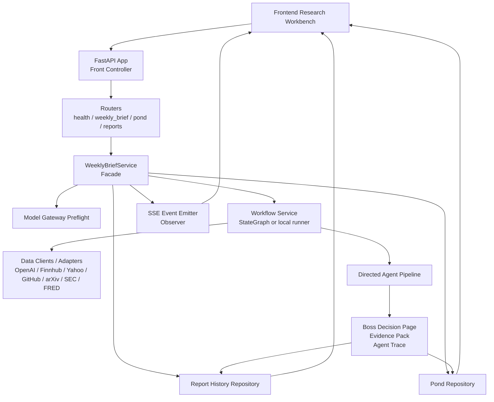

# AI Investment Agent System

## Core Principle

Plugins and skills are data-input nodes. Their job is to fetch the right data with explicit parameters.

The workflow decides how data moves.

The model layer decides what to filter, classify, summarize, challenge, and turn into a structured investment brief.

Do not configure a plugin as "click a button and hope." Configure it as:

```text
source + parameters + limits + sorting + output schema
  -> data input
  -> cleaning / dedupe
  -> model filtering, classification, summary
  -> structured AI investment brief
```

Final weekly briefs must pass the [Weekly Brief Quality Gate](weekly-brief-quality-gate.md).

Final report structures and agent handoffs are defined in the [Research Report Output Standard](research-report-output-standard.md). Full weekly briefs use Version A: `老板决策页 + 证据包`.

Every weekly brief, experiment, and single-section research run starts internally with the [Intent Router](../agents/08-intent-router.md), which produces a Route Plan before any research agent runs. The published report must still start with the Boss Decision Page; put the Route Plan in an appendix. Detailed skill behavior is defined in the [Skill Registry](skill-registry.md).

The hard minimum source modules in the AI Information & Sentiment Section are:
- 10 AI technology news items.
- 5 AI academic papers.
- 5 AI open-source projects.
- 5 high-signal sentiment evidence items.

If any module cannot meet the minimum count, the report must explain which input node failed or returned insufficient data. Missing data must not be replaced with invented items.

## Application Architecture Target

The research workflow is delivered as a local web workbench plus a backend API. The current backend refactor target is a FastAPI modular monolith: keep `python3 backend/server.py --host ... --port ...` compatible, but move route handling and business logic into `backend/app/`.

Detailed backend plan: [Backend FastAPI Refactor Plan](backend-fastapi-refactor-plan.md).



Design pattern mapping:

| Pattern | System role | Why it matters |
|---|---|---|
| Front Controller | FastAPI app + routers | One HTTP entry layer instead of a large handler class |
| Facade | `WeeklyBriefService` | Keeps route handlers thin and hides workflow/data/history complexity |
| Strategy / Adapter | data clients | Lets data sources be replaced without rewriting the workflow |
| DAO / Repository | report history and pond repositories | Separates storage from research logic |
| Observer | SSE event emitter | Streams structured agent events without polluting final report payloads |

Compatibility constraints:

- `GET /api/health` remains the health check.
- `POST /api/weekly-brief` keeps JSON and `text/event-stream` support.
- `GET /api/pond`, `POST /api/pond/select`, and `POST /api/pond/refresh` remain the pond API.
- `GET /api/reports` and `GET /api/reports/{id}` remain the report-history API.
- Response fields remain compatible: `title`, `summaryMarkdown`, `reportMarkdown`, `evidenceMarkdown`, `researchActionPool`, `agentTrace`, and `runMetadata.historyId`.
- `WEEKLY_BRIEF_MOCK`, `WEEKLY_BRIEF_UPSTREAM_URL`, and default OpenAI-compatible modes remain supported.

## Agent Roles

Detailed prompts live in:
- [Intent Router / Harness Router](../agents/08-intent-router.md)
- [Stock Discovery Analyst](../agents/00-stock-discovery-analyst.md)
- [AI Information & Sentiment Analyst](../agents/02-ai-information-sentiment-analyst.md)
- [Fundamental Analyst](../agents/03-fundamental-analyst.md)
- [Technical Analyst](../agents/04-technical-analyst.md)
- [Reflection Judge](../agents/05-reflection-judge.md)
- [AI Trend Narrative Analyst](../agents/01-ai-trend-narrative-analyst.md)
- [Skill Scout](../agents/06-skill-scout.md)
- [Paper Portfolio & Attribution Agent](../agents/07-paper-portfolio-attribution-agent.md)

## Installed US Equity Skill Stack

The current stack is research-only and focused on US-listed equities.

| Layer | Skills | Use |
|---|---|---|
| Intent routing | Installed-skill inventory plus `docs/skill-registry.md` | User intent classification, agent path selection, data-node plan, missing configuration, safety boundary check |
| AI information and sentiment | `last30days`, `youtube-full`, `bibi`, `ak-rss-digest`, `transcript-polisher` | Podcast, video, RSS, community sentiment, transcript cleanup. `youtube-full` is TranscriptAPI-backed and should use `TRANSCRIPT_API_KEY`; do not install duplicate ClawHub `transcriptapi` unless replacing it. |
| Market data and catalysts | `longbridge`, `longbridge-market-data`, `longbridge-intel`, `nasdaq-data`, `finviz`, `tradingview`, `yahoo-finance`, `global-stock-data` | Quotes, K-line, market attention, screener, news/catalyst context, zero-auth backup data |
| Fundamentals | `financial-data-collector`, `longbridge-fundamentals`, `longbridge-earnings`, `longbridge-research`, `longbridge-value-investing`, `sec-data`, `nasdaq-data`, `earningswhispers`, `yahoo-finance`, `finviz`, `global-stock-data`, `alpha-vantage`, `finnhub` | Financial statements, SEC filings, earnings, estimates, valuation, company research |
| Technicals and market regime | `technical-analyst`, `longbridge-technical`, `longbridge-market-data`, `tradingview`, `yahoo-finance`, `global-stock-data`, `cboe-data`, `fred-macro`, `finviz` | Chart-first technical analysis, volatility context, rates/macro context |
| Reflection | `cathie-wood-perspective`, `buffett-perspective` | Perspective debate over upstream evidence |
| Paper feedback loop | `longbridge-market-data`, `yahoo-finance`, `tradingview`, `global-stock-data`, `cboe-data`, `fred-macro` | Shadow-ledger price tracking, benchmark comparison, attribution |

Out of scope: broker trading, account actions, portfolio rebalancing, position sizing, order execution, and auto-trading.

Each agent is constrained by:
- A persistent System Prompt for identity, rules, boundaries, output format, and forbidden behavior.
- A per-run User Prompt template for the concrete weekly task, input sources, filters, and required result.
- A `Downstream Handoff` block that tells the next agent what evidence, assumptions, missing proof, downgrade triggers, and forbidden carry-over claims it may inherit.

This is a directed section pipeline, not a roundtable. The Intent Router selects the path first. The final conclusion is produced after stock discovery, information/sentiment, fundamental, technical, and reflection sections are complete. Paper Portfolio & Attribution runs after the final conclusion as a feedback loop.

### R. Intent Router / Harness Router

Purpose: classify the user's request and produce an Intent Route Plan before any research section runs.

Output:
- Task type.
- Selected agents and skipped agents.
- Skill / data node plan.
- Missing inputs, API configuration, and default assumptions.
- Safety boundary check.
- Applicable quality gate.

Rule: the router does not make investment claims. It only decides what should run and what each section needs.

### 0. Stock Discovery Analyst

Purpose: generate a capped, high-signal candidate stock pool and reject noise before deep research starts.

Inputs:
- Executive speeches, YouTube interviews, podcasts, conference talks.
- Earnings calls and management commentary.
- Customer capex, supplier/customer relationships, catalysts.
- GitHub/developer adoption and market/technical screens.

Output:
- Active research candidates, default max 8.
- Watchlist candidates.
- Rejected/deferred noise.
- Signal quality score and downstream routing.

Rule: a candidate is not a recommendation. Active candidates need at least two independent signal families by default.

### 1. AI Information & Sentiment Analyst

Purpose: collect and organize the AI information and sentiment section, including RSS/news, YouTube/podcasts, last30days, GitHub, arXiv, and related skills.

Inputs:
- RSS/news and `ak-rss-digest`.
- YouTube/podcasts through `youtube-full`, `bibi`, and `transcript-polisher`.
- last30days across Reddit, X, YouTube, Hacker News, Polymarket, GitHub, and web.
- GitHub project signals.
- arXiv and research feeds.

Output:
- 10 AI technology news items.
- 5 AI academic papers.
- 5 AI open-source projects.
- YouTube/podcast notes.
- 5 high-signal sentiment evidence items.
- Candidate narratives and questions for downstream sections.
- Current observed AI trend story.
- Long-horizon AI trend projection.
- AI value-chain expansion map.

Rule: this section organizes information and sentiment, then drafts candidate stories for downstream validation. It must not produce final investment conclusions.

Narrative rule:
- Current observed stories must be grounded in dated evidence.
- Long-horizon projections can look far ahead, but every step must be labeled as fact, inference, or long-term hypothesis.
- Value-chain expansion should trace second-order and third-order effects, such as AI capability changes -> compute demand -> chips, networking, cloud, data centers, power, cooling, equipment, software automation, robotics, or other affected layers.

### 2. Fundamental Analyst

Inputs:
- AI Information & Sentiment Section as candidate narrative input.
- Financial statements.
- Earnings calls.
- Segment revenue.
- Capex and demand indicators.
- Analyst estimates and valuation multiples.
- Installed finance skills for US equity data and cross-checking.

Output:
- Financial transmission path.
- Which companies benefit directly vs indirectly.
- What must show up in future financials.
- Key falsification metrics.

Rule: information and sentiment can identify what to test, but cannot serve as financial proof.

Data rule: key financial claims should be checked against at least two independent sources where possible. If sources conflict, the report must mark the section partial and explain the conflict.

### 3. Technical Analyst

Purpose: judge whether price action supports the candidate narratives, while keeping the first pass chart-only.

Inputs:
- Candidate tickers from the AI Information & Sentiment Section or the user.
- K-line charts.
- Volume.
- Moving averages.
- Support and resistance.
- Breakout / rejection / exhaustion patterns.

Output:
- Trend state.
- Key levels.
- Bull/base/bear scenarios.
- Invalidation points.

Rule: this agent should stay chart-first and should not be influenced by narrative or fundamentals during its first pass.

### 4. Reflection Section

Purpose: review the information/sentiment, fundamental, and technical sections for closed-loop consistency.

Required chain:

```text
AI information and sentiment
  -> industry impact
  -> company fundamentals
  -> valuation / expectations
  -> market price action
  -> falsifiable future checks
```

Output:
- What is proven.
- What is assumed.
- Where the chain breaks.
- Which evidence would change the conclusion.
- Which stories should be kept, downgraded, or left undecided.
- Audit of current observed stories.
- Audit of long-horizon projections and value-chain expansion.
- Cathie Wood vs Buffett perspective debate summary.

Required perspective skills:
- `cathie-wood-perspective`: disruptive innovation / AI long-horizon bull lens.
- `buffett-perspective`: value investing / moat / safety margin lens.

Rule: these perspectives are reasoning lenses over upstream evidence, not new evidence sources.

### 5. Final AI Trend Narrative Analyst

Purpose: produce the final AI trend investment research conclusion after all upstream sections are complete.

Inputs:
- AI Information & Sentiment Section.
- Fundamental Section.
- Technical Section.
- Reflection Section.
- Wood vs Buffett debate summary.

Output:
- Boss conclusion page.
- Top 5 Research Action Pool.
- Core judgment table with hard evidence.
- Research tiering by evidence strength.
- Final weekly conclusion.
- Current observed AI trend story.
- Long-horizon AI trend projection.
- Kept stories.
- Downgraded stories.
- Investment impact map.
- Risks,反证条件, and next-week checks.
- Research action rating: Research Buy / Hold-Watch / Take-Profit / Trim Bias / Avoid-Sell Bias / No Rating.

Rule: this is the final synthesis layer. It should not behave like another raw data collector, evidence dump, or process audit.

Output boundary:
- The published report begins with a conclusion-first Boss Decision Page. The Intent Route Plan is generated first internally but appears later as an appendix.
- The first page states the main judgment, first-tier/second-tier/observation/excluded candidates, highest-conviction evidence, largest falsification risk, and next-week validation.
- The main report uses two-hop evidence linking: candidate row -> sibling evidence subfile -> original source links.
- The final synthesis may output research action ratings with 0-100 confidence. Only `Research Buy` candidates with confidence >=75 and no major Reflection break can enter the Top 5 Research Action Pool.
- Data-node status, tool failures, route details, and quality checklists are required but must be placed after the main conclusion and core evidence chain as appendices.
- High-conviction claims need 2-3 hard evidence summaries plus an `Evidence Pack` link to `reports/{report_slug}.evidence.md`. Weakly supported stories must be downgraded, deferred, or excluded.

### Maintenance Agent: Skill Scout

Purpose: review new GitHub skills weekly and recommend or low-risk auto-install add-on capabilities for this system.

The user has approved low-risk auto-installation for read-only data-input and reasoning-lens skills that pass benchmarks and internal review. It must not install broker, order execution, account access, position-sizing, credential-reading, or opaque installer skills.

## Input Node Configuration

### RSS Node

RSS sources must be explicit. Each source needs a concrete feed URL.

Example schema:

```yaml
rss_sources:
  - name: 36Kr
    url: "<rss-url>"
    category: cn_media
    max_items: 20
    lookback_days: 7
  - name: Huxiu
    url: "<rss-url>"
    category: cn_media
    max_items: 20
    lookback_days: 7
  - name: InfoQ
    url: "<rss-url>"
    category: tech_media
    max_items: 20
    lookback_days: 7
```

What it solves:
- Which media sources to read.
- How many items to fetch.
- How far back to look.

### GitHub Node

GitHub search must define keywords, count, and sorting.

Example schema:

```yaml
github_searches:
  - name: ai_agent_projects
    q: "AI agent stars:>500"
    per_page: 10
    sort: updated
    order: desc
  - name: inference_infra
    q: "LLM inference OR vLLM OR SGLang stars:>500"
    per_page: 10
    sort: updated
    order: desc
  - name: agent_skills
    q: '"SKILL.md" "Codex" OR "Claude Code" stars:>100'
    per_page: 20
    sort: stars
    order: desc
```

What it solves:
- Which projects to inspect.
- How many repositories to pull.
- How to sort results.

### arXiv Node

arXiv search must define query, count, and sorting.

Example schema:

```yaml
arxiv_searches:
  - name: ai_agents
    search_query: 'cat:cs.AI AND ("agent" OR "tool use" OR "reasoning")'
    count: 5
    sort_by: submittedDate
    sort_order: descending
  - name: inference_scaling
    search_query: 'cat:cs.LG AND ("inference" OR "test-time compute" OR "reasoning")'
    count: 5
    sort_by: submittedDate
    sort_order: descending
```

What it solves:
- Which research direction to inspect.
- How many papers to include.
- How fresh the research should be.

## Skill Scout Benchmarks

Heat evidence should use fixed benchmarks, not growth trend.

A candidate skill can enter the weekly "Suggested Add-On Features" section only if:

1. It is not already installed in the local skill collection.
2. It is relevant to at least one agent role above.
3. It reaches at least one benchmark:
   - GitHub stars >= 100 for niche skills.
   - GitHub stars >= 500 for general-purpose skills.
   - Forks >= 10.
   - Issues + PRs + Discussions show meaningful user activity.
   - It appears in a curated list such as awesome-agent-skills, ClawHub, or a well-maintained registry.
4. It passes a basic internal review:
   - Clear `SKILL.md` description and trigger conditions.
   - Scoped tool permissions.
   - No obvious credential harvesting.
   - No suspicious full-disk reads.
   - No hidden install scripts or unexplained `curl | bash`.
   - No automatic trading, posting, purchasing, or account actions.
5. It improves the system more than it increases complexity.

Recommended output:

```markdown
## Suggested Add-On Features

| Candidate | Adds What | Benchmark Hit | Relevant Agent | Risk | Recommendation | Install Status | Install Path |
|---|---|---|---|---|---|---|---|
| skill-name | RSS / GitHub / arXiv / finance / charting | stars/forks/activity/listing | Agent 1/2/3/4/5 | Low/Medium/High | Install / Watch / Reject | installed / not installed / failed | path or n/a |
```

Default recommendation policy:
- Install: clear utility, benchmark hit, low risk; auto-install only read-only data-input or reasoning-lens skills and log evidence.
- Watch: useful but duplicate, immature, or medium risk.
- Reject: irrelevant, unsafe, overbroad, or low signal.

## Weekly Report Flow

```text
User request
  -> Intent Router / Route Plan
  -> RSS / GitHub / arXiv / Podcasts / YouTube / last30days
  -> data input nodes
  -> Stock Discovery Section
  -> dedupe and normalization
  -> AI Information & Sentiment Section
  -> Fundamental Section
  -> Technical Section
  -> Reflection Section
  -> Final AI Trend Narrative Conclusion
  -> Paper Portfolio & Attribution Section
  -> weekly structured AI investment brief
  -> Skill Scout: Suggested Add-On Features as a separate appendix
```

The "Suggested Add-On Features" section should be separate from the investment thesis. It is about improving the research system, not making a trade.

## Final Acceptance Criteria

Before a final weekly brief is considered complete, it must check:

- Content accuracy: no fabrication, no broken evidence links, no stale information presented as current.
- Intent routing: route type, selected/skipped agents, skill plan, and missing inputs are explicit.
- Format completeness: includes AI technology news, AI academic papers, AI open-source projects, and AI information/sentiment evidence.
- Executive readability: starts with the Boss Decision Page, not the Intent Route Plan, process status, or raw evidence tables.
- Agent trace readability: UI and streaming outputs show public reasoning summaries, data nodes, findings, judgments, next steps, and Reflection debate summaries instead of raw Markdown or hidden chain-of-thought.
- Evidence auditability: every Top 5 / core candidate has an Evidence Pack link to a sibling evidence subfile, and that subfile links to original sources.
- Actionability: includes research action ratings, confidence scores, and Top 5 eligibility without giving order execution, position sizing, or account instructions.
- Language style: professional, concise, and similar to a technology intelligence brief.
- Quantity requirements: at least 10 news items, 5 papers, 5 projects, and 5 high-signal sentiment evidence items.
- Noise control: active research candidates are capped at 8 unless explicitly overridden.
- Feedback loop: paper observations are reviewed and attributed when prior observations exist.
- Tool/data return: every used input node must report success, partial success, or failure.
