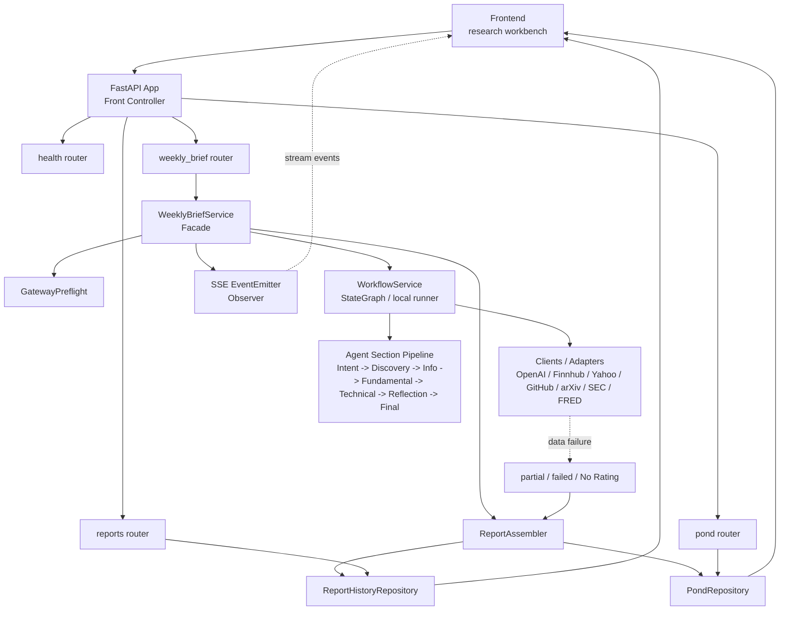

# Backend FastAPI Refactor Plan

返回：[README](../README.md) · [Backend README](../backend/README.md) · [System Design](ai-investment-agent-system.md)

这份文档记录后端从单文件原型走向 FastAPI 模块化单体的目标架构。它对应当前重构计划：先把后端结构拆清楚，再继续做 workflow debug、并行资料搜集、舆情评分和股票选择优化。

## 目标

- `backend/server.py` 保持为兼容启动器，继续支持 `python3 backend/server.py --host ... --port ...`。
- 后端业务逻辑迁移到 `backend/app/`，按 router / service / client / repository / schema / core 分层。
- 所有后端 Python 文件目标保持 `<2000` 行，入口文件保持很薄。
- 保留现有 HTTP API 行为和前端调用方式。
- 保留 mock / proxy / openai 三种运行模式。

## 目标目录

```text
backend/
├── server.py
├── requirements.txt
└── app/
    ├── __init__.py
    ├── main.py
    ├── routers/
    │   ├── health.py
    │   ├── weekly_brief.py
    │   ├── pond.py
    │   └── reports.py
    ├── services/
    │   ├── weekly_brief_service.py
    │   ├── workflow_service.py
    │   ├── report_assembler.py
    │   └── gateway_preflight.py
    ├── clients/
    │   ├── openai_compatible.py
    │   ├── finnhub.py
    │   ├── yahoo.py
    │   ├── github.py
    │   ├── arxiv.py
    │   ├── sec.py
    │   └── fred.py
    ├── repositories/
    │   ├── report_history_repository.py
    │   └── pond_repository.py
    ├── schemas/
    │   ├── weekly_brief.py
    │   ├── pond.py
    │   └── reports.py
    └── core/
        ├── config.py
        ├── env.py
        ├── errors.py
        ├── markdown.py
        └── time_utils.py
```

## API 分组

| Router | Endpoint | 用途 |
|---|---|---|
| `health` | `GET /api/health` | 后端连通性、模式、模型网关配置状态 |
| `weekly_brief` | `POST /api/weekly-brief` | 生成周报，支持 JSON 和 `text/event-stream` |
| `pond` | `GET /api/pond` | 读取 Conclusion Pond / shadow ledger 观察项 |
| `pond` | `POST /api/pond/select` | 用户选择候选进入观察池 |
| `pond` | `POST /api/pond/refresh` | 刷新观察池价格和归因字段 |
| `reports` | `GET /api/reports` | 读取报告历史列表 |
| `reports` | `GET /api/reports/{id}` | 读取单份历史报告 |

## 流程图



## 设计模式映射

| Design Pattern | 项目落点 | 解决的问题 |
|---|---|---|
| Front Controller | FastAPI app + routers | 统一入口和路由分发，替代巨型 `BaseHTTPRequestHandler` |
| Facade | `WeeklyBriefService` | 路由不直接知道 data nodes、workflow、history、pond 的细节 |
| Strategy / Adapter | `clients/*` | 每个外部数据源用相似接口采集，后续可替换或新增 |
| DAO / Repository | `repositories/*` | 报告历史、池塘 CSV/JSON 读写从业务逻辑剥离 |
| Observer | SSE event emitter | workflow 节点只发结构化事件，前端可流式展示 Agent Trace |

## 兼容性要求

- 启动命令保持兼容：

```bash
python3 backend/server.py --host 127.0.0.1 --port 8787
```

- 前端默认 endpoint 保持：

```text
http://127.0.0.1:8787/api/weekly-brief
```

- 返回字段保持兼容：

```json
{
  "title": "报告标题",
  "summaryMarkdown": "# 老板决策页...",
  "reportMarkdown": "# 完整周报...",
  "evidenceMarkdown": "# 证据包...",
  "researchActionPool": [],
  "agentTrace": [],
  "runMetadata": {
    "historyId": "..."
  }
}
```

- 三种模式保留：
  - `WEEKLY_BRIEF_MOCK=1`
  - `WEEKLY_BRIEF_UPSTREAM_URL=http://...`
  - 默认 OpenAI-compatible `/chat/completions`
- `.env` 加载语义保留：本地 `.env` 默认覆盖继承环境变量。

## 测试计划

重构完成后必须运行：

```bash
python3 -m unittest discover tests
node tests/frontend-backend-integration.test.mjs
node tests/frontend-start-experience.test.mjs
node tests/error-message-routing.test.mjs
```

新增或更新测试：

| 测试 | 要求 |
|---|---|
| 结构测试 | 扫描 `backend/**/*.py`，排除 `__pycache__`，断言每个文件 `<2000` 行 |
| FastAPI smoke test | health、mock weekly brief、report history、pond select / refresh |
| SSE test | `text/event-stream` 必须以 `[DONE]` 结束，并让前端能完成渲染 |
| Repository tests | pond/env/history 相关测试直接测新模块，不依赖巨型 `backend.server` |

## 当前边界

- 本计划只拆后端，不在同一轮处理 `frontend/app.js` 超过 2000 行的问题。
- 本计划不改变投资研究逻辑和输出内容。
- 并行资料搜集、舆情打分、股票选择流程优化放在后端结构清晰后的下一步。
- 后端仍然只支持研究工作流，不接交易、账户、仓位或自动下单能力。
