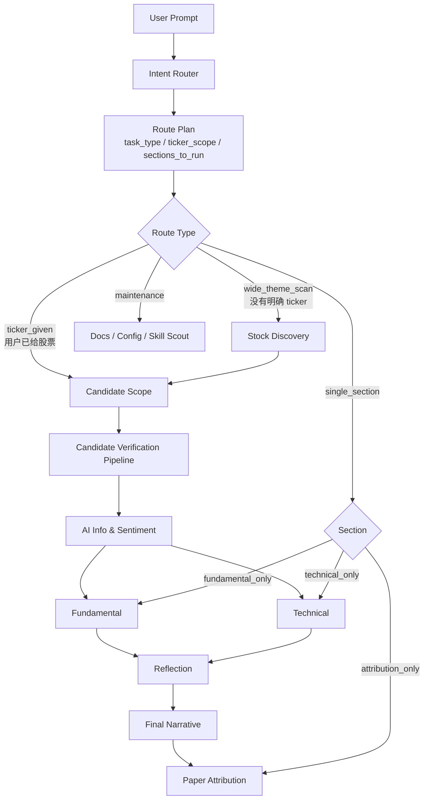

# LangGraph Orchestration

返回：[README](../README.md) · [Docs Map](README.md) · [Agent Responsibilities](agent-responsibilities.md)

LangGraph 在这个项目里承担的是**工作流编排层**，不是某个单独 agent 的 prompt。它把多 Agent 投研流程组织成一个可路由、可追踪、可降级的状态机。

## 解决什么问题

如果所有任务都固定跑一条完整流水线，会出现几个问题：

- 用户已经给了股票，还重复做 Stock Discovery。
- 用户只想看基本面或技术面，却被迫生成完整周报。
- 某个数据节点失败时，不知道应该中断、降级，还是继续跑后续节点。
- 前端很难展示当前跑到哪一步、缺什么证据、下一步交给谁。

LangGraph / StateGraph Harness 的作用是让这些判断显式化。

## 核心状态

工作流会维护一份共享 state，典型字段包括：

| 字段 | 用途 |
|---|---|
| `user_prompt` | 用户原始研究意图 |
| `route_plan` | Intent Router 生成的任务路线 |
| `task_type` | 完整周报、单模块、复盘、维护等任务类型 |
| `ticker_scope` | 当前研究股票范围，来自用户给定 ticker 或 Stock Discovery 输出 |
| `sections_to_run` | 本次需要运行的 agent sections |
| `data_bundle` | 新闻、论文、GitHub、行情、财报、SEC 等证据包 |
| `agent_trace` | 前端展示的公开执行状态和证据缺口 |
| `section_outputs` | 各 agent 的结构化输出 |
| `report_payload` | 最终返回给前端的报告、证据包和 metadata |

## 路由逻辑

## 几种典型路线

| 用户输入类型 | Route Plan | 实际执行 |
|---|---|---|
| “本周 AI inference 和数据中心机会” | `wide_theme_scan` | 先用广域数据做 Stock Discovery，再进入完整验证链路 |
| “分析 NVDA、AMD、AVGO” | `ticker_given` | 跳过 Stock Discovery，直接把这几个 ticker 作为 Candidate Scope |
| “只看 NVDA 基本面” | `single_section: fundamental_only` | 只跑 Fundamental，必要时读取相关信息和财务数据 |
| “只看 AMD 技术面” | `single_section: technical_only` | 只跑 Technical，不强制跑信息面和基本面 |
| “复盘上周观察池” | `single_section: attribution_only` | 读取 Conclusion Pond / Paper Portfolio，做 thesis attribution |
| “整理文档、检查配置、推荐 skill” | `maintenance` | 不运行投资研究链路，只输出维护结果 |

## Stock Discovery 和 Candidate Scope 的关系

`Stock Discovery` 是候选发现，不是最终研究结论。

当用户没有给股票时，Stock Discovery 会读取广域发现数据：

- AI 技术新闻
- 论文 / arXiv
- GitHub 开源项目
- ETF / 行业异动
- 财报、capex、供应链线索
- 行情、相对强弱、技术面初筛

它的输出是：

- `active candidates`：默认最多 8 个，进入后续验证
- `watchlist`：证据还不够强，暂时观察
- `reject / deferred`：噪音、低流动性、证据不足或不符合边界

当用户已经给了股票，系统不会再重新发现股票，而是直接把这些 ticker 作为 `Candidate Scope`。后续仍会收集验证数据，包括信息流、基本面、技术面、反方审查和证据包。

## 失败和降级

LangGraph 编排层会把失败状态写入 state，而不是让后续节点盲目假装成功。

| 情况 | 处理 |
|---|---|
| 数据节点失败 | 写入 `data_node_status`，最终报告标 `partial` |
| 证据不足 | 降级为 `No Rating` 或 watchlist |
| 基本面和技术面冲突 | 交给 Reflection 标出断裂点 |
| 用户只要求单模块 | 不强制跑完整周报 |
| 维护任务 | 跳过投资研究 agent，避免无关输出 |

## 前端可观测性

每个节点执行时可以通过 SSE 输出公开状态：

- 当前 agent
- 当前判断
- 使用或缺失的数据节点
- 发现的证据或缺口
- 当前降级状态
- 下一步交给哪个节点

这些内容进入 Agent Visible Trace。最终报告仍由报告组装器生成，避免把原始流式日志混进正式报告。
